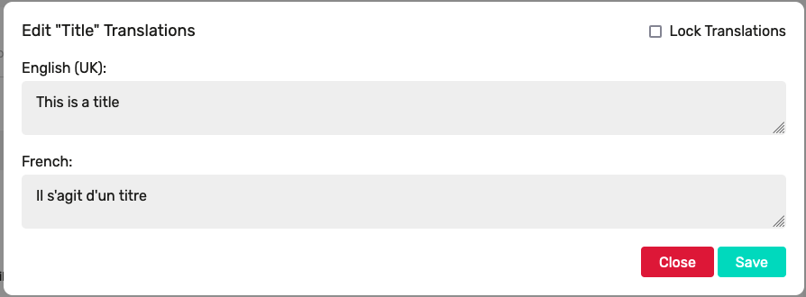

# User generated content translation package 

[](https://packagist.org/packages/rpwebdevelopment/laravel-ugc-translate)
[](https://packagist.org/packages/rpwebdevelopment/laravel-ugc-translate)
[](https://github.com/DeepLcom/deepl-php/blob/main/LICENSE)

This is a Laravel specific package designed to automate the translation of user generated content in a database driven fashion.

## Installation

You can install the package via composer:

```bash
composer require rpwebdevelopment/laravel-ugc-translate

php artisan vendor:publish --tag="ugc-translate-migrations"
php artisan migrate

php artisan vendor:publish --tag="ugc-translate-config"
```

## Configuration

This package offers you the option of using the free-to-use, zero configuration 
[Google Translate](https://github.com/Stichoza/google-translate-php) package from 
[Stichoza](https://github.com/Stichoza), or [DeepL API](https://github.com/DeepLcom/deepl-php), 
or [Amazon Translate](https://aws.amazon.com/translate/).
 
If leveraging the DeepL API you will need to add a valid `DEEPL_AUTH_TOKEN` to your `.env`.

If leveraging the Amazon Translate API you will need to ensure you have valid `AWS_ACCESS_KEY_ID`, 
`AWS_SECRET_ACCESS_KEY` and `AWS_DEFAULT_REGION` values set in your `.env`.

If you do not wish every record update/creation to trigger automatic translation, you can disable the observer by 
adding the following to your `.env` file:

```php
UGC_AUTO_TRANSLATE_DISABLED=true
```

Sometimes you may only want translations enabled on a model if certain conditions are met, for example if a flag is 
set against the model instance, in order to achieve this you can add the method `getHasTranslationsAttribute` to the 
model returning a boolean value, i.e.
```php
    public function getHasTranslationsAttribute(): bool
    {
        // your code here - returning bool
    }
```

You can update the config file `ugc-translate.php` in order to set any languages needed for translation:
```php
    'translation-languages' => [
        'en-GB',
        'fr',
        'it',
        'de',
    ],
```

## Usage

The package provides a new trait that can be used in order to apply automatic translations:

```php
<?php

namespace App\Models;

use Illuminate\Database\Eloquent\Model;
use RpWebDevelopment\LaravelUgcTranslate\Traits\HasTranslatable;

class Posts extends Model
{
    use HasTranslatable;
    
    protected $guarded = [];
}
```

In order to define translatable fields, and languages required for translation our models will now require a new 
property `$ugcTranslatable` defining the DB fields to be translated:

```php
<?php

namespace App\Models;

use Illuminate\Database\Eloquent\Model;
use RpWebDevelopment\LaravelUgcTranslate\Traits\HasTranslatable;

class Posts extends Model
{
    use HasTranslatable;
 
    public array $ugcTranslatable = [
        'title',
        'body',
    ];

    protected $guarded = [];
}
```

Unless you have disabled auto-translate, creating or updating a record within your model will cause translations 
to be generated and stored. The package leverages Laravel's `locale` in order to assert which language is to be 
returned. If we take our posts model above with the following record:

```
| id  | title           | body                    |
| --- | --------------- | ----------------------- |
| 1   | This is a title | This is the main text   |
```

You can achieve the following:
```php
$post = App\Models\Post::find(1);

app()->setLocale('en_GB');
echo $post->title;
// outputs "This is a title"

app()->setLocale('it');
echo $post->title;
// outputs "Questo è un titolo"

app()->setLocale('fr');
echo $post->title;
// outputs "Il s'agit d'un titre"
```

Sometimes you may wish to output a specific language value without switching the application locale,
this can be achieved using the following method:
```php
$post = App\Models\Post::find(1);

app()->setLocale('en_GB');
echo $post->title;
// outputs "This is a title"

echo $post->localeField('title', 'it');
// outputs "Questo è un titolo"

echo $post->localeField('title', 'fr');
// outputs "Il s'agit d'un titre"
```

Sometimes you may not need all the default languages for every model, in order to override the default languages on 
a model you can simply add the `getUgcLanguagesAttribute` method to the model returning an array of locale codes:
```php
<?php

namespace App\Models;

use Illuminate\Database\Eloquent\Model;
use RpWebDevelopment\LaravelUgcTranslate\Traits\HasTranslatable;

class Posts extends Model
{
    use HasTranslatable;
    
    protected $guarded = [];
    
    public function getUgcLanguagesAttribute(): array
    {
        return ['en_GB', 'it'];
    }
}
```

If you use Livewire in your application there is a custom modal available for editing & locking specific translations,
you can publish the modal component and view by runningg the following command:
```php
php artisan vendor:publish --tag="ugc-translate-livewire"
```

Once published you can add the modal into your project with the following tag:
```php
<livewire:ugc.modal :model="$model" field="title" />
```

This will add a button to your blade template that will open the following modal:



Locking translations will prevent them from being automatically updated.

## Changelog

Please see [CHANGELOG](CHANGELOG.md) for more information on what has changed recently.

## Credits

- [Rich Porter](https://github.com/rpwebdevelopment)

## License

The MIT License (MIT). Please see [License File](LICENSE.md) for more information.
